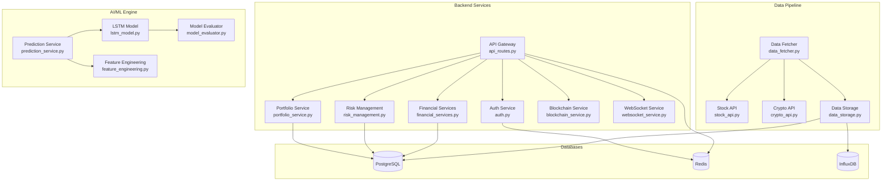

# Architecture Overview

High-level system design, module structure, data flow, and component diagrams for QuantumVest.

## Table of Contents

- [System Architecture](#system-architecture)
- [Component Diagram](#component-diagram)
- [Data Flow](#data-flow)
- [Module Structure](#module-structure)
- [Technology Stack](#technology-stack)
- [Deployment Architecture](#deployment-architecture)

---

## System Architecture

QuantumVest follows a **modular microservices-inspired architecture** with clear separation of concerns:

```
┌─────────────────────────────────────────────────────────────────┐
│                         Client Layer                             │
│  ┌──────────────┐  ┌──────────────┐  ┌──────────────┐          │
│  │ Web Frontend │  │    Mobile    │  │  External    │          │
│  │   (React)    │  │ (React Native│  │   API Clients│          │
│  └──────────────┘  └──────────────┘  └──────────────┘          │
└─────────────────────────────────────────────────────────────────┘
                           ▼ HTTP/WebSocket
┌─────────────────────────────────────────────────────────────────┐
│                         API Gateway                              │
│         ┌───────────────────────────────────────┐               │
│         │  Flask REST API (api_routes.py)      │               │
│         │  Authentication / Rate Limiting       │               │
│         └───────────────────────────────────────┘               │
└─────────────────────────────────────────────────────────────────┘
                           ▼
┌─────────────────────────────────────────────────────────────────┐
│                      Business Logic Layer                        │
│                                                                   │
│  ┌───────────────┐ ┌───────────────┐ ┌───────────────┐         │
│  │   Portfolio   │ │  Financial    │ │  Risk Mgmt    │         │
│  │   Service     │ │  Services     │ │  Service      │         │
│  └───────────────┘ └───────────────┘ └───────────────┘         │
│                                                                   │
│  ┌───────────────┐ ┌───────────────┐ ┌───────────────┐         │
│  │     Auth      │ │  Blockchain   │ │   WebSocket   │         │
│  │   Service     │ │   Service     │ │   Service     │         │
│  └───────────────┘ └───────────────┘ └───────────────┘         │
└─────────────────────────────────────────────────────────────────┘
                           ▼
┌─────────────────────────────────────────────────────────────────┐
│                      AI/ML Engine Layer                          │
│                                                                   │
│  ┌────────────────────────────────────────────────────────┐    │
│  │           Prediction Service                            │    │
│  │  ┌──────────────┐  ┌──────────────┐  ┌──────────────┐ │    │
│  │  │  LSTM Model  │  │  Sentiment   │  │   Pattern    │ │    │
│  │  │  (Stock/Cry  │  │  Analyzer    │  │  Recognition │ │    │
│  │  └──────────────┘  └──────────────┘  └──────────────┘ │    │
│  └────────────────────────────────────────────────────────┘    │
│                                                                   │
│  ┌────────────────────────────────────────────────────────┐    │
│  │           Training Pipeline                             │    │
│  │  - Data Preprocessing                                   │    │
│  │  - Feature Engineering                                  │    │
│  │  - Model Training                                       │    │
│  │  - Model Evaluation                                     │    │
│  └────────────────────────────────────────────────────────┘    │
└─────────────────────────────────────────────────────────────────┘
                           ▼
┌─────────────────────────────────────────────────────────────────┐
│                       Data Layer                                 │
│                                                                   │
│  ┌───────────────┐ ┌───────────────┐ ┌───────────────┐         │
│  │  PostgreSQL   │ │     Redis     │ │   InfluxDB    │         │
│  │  (User/Port   │ │  (Cache/Queue)│ │(Time Series)  │         │
│  │   folio)      │ │               │ │               │         │
│  └───────────────┘ └───────────────┘ └───────────────┘         │
│                                                                   │
│  ┌───────────────┐ ┌───────────────┐                           │
│  │  Blockchain   │ │    Object     │                           │
│  │    Nodes      │ │   Storage     │                           │
│  │  (ETH/BSC)    │ │   (S3/MinIO)  │                           │
│  └───────────────┘ └───────────────┘                           │
└─────────────────────────────────────────────────────────────────┘
                           ▼
┌─────────────────────────────────────────────────────────────────┐
│                  External Services Layer                         │
│                                                                   │
│  ┌───────────────┐ ┌───────────────┐ ┌───────────────┐         │
│  │Alpha Vantage  │ │   CoinGecko   │ │   Chainlink   │         │
│  │  (Stock Data) │ │ (Crypto Data) │ │   Oracles     │         │
│  └───────────────┘ └───────────────┘ └───────────────┘         │
└─────────────────────────────────────────────────────────────────┘
```

---

## Component Diagram

### Core Components



---

## Data Flow

### 1. User Authentication Flow

```
User → [POST /auth/login] → API Gateway
  → Auth Service → Validate Credentials (PostgreSQL)
  → Generate JWT Tokens → Cache Session (Redis)
  → Return Tokens → User
```

### 2. Price Prediction Flow

```
User → [GET /predictions/stocks/AAPL] → API Gateway
  → Check Cache (Redis) → [MISS]
  → Prediction Service → Fetch Historical Data (Stock API)
  → Feature Engineering → LSTM Model → Generate Prediction
  → Cache Result (Redis, TTL=1h) → Return Prediction → User
```

### 3. Portfolio Update Flow

```
User → [POST /portfolios/{id}/transactions] → API Gateway
  → Authenticate (JWT) → Portfolio Service
  → Validate Transaction → Update Portfolio (PostgreSQL)
  → Recalculate Metrics → Update Cache (Redis)
  → Notify via WebSocket → Return Success → User
```

### 4. Real-Time Data Flow

```
External API → Data Fetcher (Celery Task)
  → Parse & Transform → Data Storage → InfluxDB
  → Trigger WebSocket Event → WebSocket Service
  → Broadcast to Subscribed Clients
```

---

## Module Structure

### Backend Module Mapping

| Directory                     | Purpose                              | Key Files                                            |
| ----------------------------- | ------------------------------------ | ---------------------------------------------------- |
| `code/backend/`               | Main backend application             | `app.py`, `api_routes.py`, `models.py`               |
| `code/backend/data_pipeline/` | Data fetching and processing         | `data_fetcher.py`, `stock_api.py`, `crypto_api.py`   |
| `code/backend/services/`      | Business logic services              | `quant_analysis.py`                                  |
| `code/ai_models/`             | ML model training                    | `train_prediction_model.py`, `advanced_ai_models.py` |
| `code/blockchain/`            | Blockchain contracts and integration | `contracts/*.sol`, `smart_contracts.sol`             |
| `web-frontend/`               | React web application                | `src/`                                               |
| `mobile-frontend/`            | React Native mobile app              | `src/`                                               |
| `infrastructure/`             | DevOps and deployment                | `kubernetes/`, `terraform/`, `ansible/`              |

### Backend File Organization

```
code/backend/
├── app.py                      # Flask application factory
├── api_routes.py               # REST API endpoints
├── models.py                   # SQLAlchemy database models
├── auth.py                     # Authentication service
├── portfolio_service.py        # Portfolio management
├── risk_management.py          # Risk calculations
├── financial_services.py       # Financial analysis services
├── blockchain_service.py       # Blockchain integration
├── websocket_service.py        # Real-time WebSocket
├── security.py                 # Security utilities
├── config.py                   # Configuration management
├── data_pipeline/
│   ├── data_fetcher.py         # Data fetching orchestration
│   ├── stock_api.py            # Stock data API
│   ├── crypto_api.py           # Crypto data API
│   ├── data_storage.py         # Data persistence
│   ├── feature_engineering.py  # Feature extraction
│   ├── lstm_model.py           # LSTM prediction model
│   ├── prediction_service.py   # Prediction API
│   └── model_evaluator.py      # Model evaluation
├── services/
│   └── quant_analysis.py       # Quantitative analysis
└── tests/
    ├── test_endpoints.py       # API endpoint tests
    ├── test_integration.py     # Integration tests
    └── validate_pipeline.py    # Pipeline validation
```

---

## Technology Stack

### Backend Stack

| Component          | Technology     | Version | Purpose                 |
| ------------------ | -------------- | ------- | ----------------------- |
| **Framework**      | Flask          | 2.3.3   | Web framework           |
| **ORM**            | SQLAlchemy     | 2.0.21  | Database ORM            |
| **Database**       | PostgreSQL     | 12+     | Relational database     |
| **Cache**          | Redis          | 5.0+    | Caching and queues      |
| **Task Queue**     | Celery         | 5.3.2   | Background tasks        |
| **WebSocket**      | Flask-SocketIO | -       | Real-time communication |
| **Authentication** | PyJWT          | 2.8.0   | JWT tokens              |

### AI/ML Stack

| Component           | Technology   | Version | Purpose                 |
| ------------------- | ------------ | ------- | ----------------------- |
| **Deep Learning**   | TensorFlow   | 2.13.0  | Neural networks         |
| **Deep Learning**   | PyTorch      | 2.0.1   | Alternative framework   |
| **ML Framework**    | scikit-learn | 1.3.0   | Traditional ML          |
| **Data Processing** | Pandas       | 2.1.1   | Data manipulation       |
| **Numerical**       | NumPy        | 1.24.3  | Numerical computing     |
| **Time Series**     | Prophet      | 1.1.4   | Time series forecasting |

### Frontend Stack

| Component            | Technology  | Version | Purpose                |
| -------------------- | ----------- | ------- | ---------------------- |
| **Framework**        | React       | 17.0.2  | UI framework           |
| **State Management** | Redux       | -       | State management       |
| **UI Library**       | Material-UI | 5.12.1  | Component library      |
| **Charts**           | Chart.js    | 3.9.1   | Data visualization     |
| **Web3**             | web3.js     | 1.10.0  | Blockchain interaction |

---

## Deployment Architecture

### Production Deployment (Kubernetes)

```
┌─────────────────────────────────────────────────────────────┐
│                        Load Balancer                         │
│                  (Ingress Controller)                        │
└─────────────────────────────────────────────────────────────┘
                           │
        ┌──────────────────┴──────────────────┐
        │                                     │
   ┌────▼────┐                          ┌────▼────┐
   │Frontend │                          │  Backend│
   │  Pods   │                          │   Pods  │
   │(Nginx + │                          │ (Gunicorn)│
   │ React)  │                          │          │
   └─────────┘                          └────┬─────┘
                                             │
        ┌────────────────────────────────────┼────────────────┐
        │                                    │                │
   ┌────▼────┐                         ┌────▼────┐     ┌─────▼─────┐
   │PostgreSQL│                        │  Redis  │     │ Celery    │
   │StatefulSet│                       │  Pods   │     │ Workers   │
   └──────────┘                        └─────────┘     └───────────┘
```

### Scaling Strategy

| Component      | Scaling Type           | Min Replicas | Max Replicas    |
| -------------- | ---------------------- | ------------ | --------------- |
| Frontend       | Horizontal             | 2            | 10              |
| Backend API    | Horizontal             | 3            | 20              |
| Celery Workers | Horizontal             | 2            | 10              |
| PostgreSQL     | Vertical + Replication | 1 master     | 2 read replicas |
| Redis          | Vertical + Clustering  | 3            | 6               |

---

## Security Architecture

### Security Layers

1. **Network Security**
    - HTTPS/TLS encryption
    - VPC isolation
    - Firewall rules
    - DDoS protection

2. **Application Security**
    - JWT authentication
    - Rate limiting
    - Input validation
    - SQL injection prevention
    - XSS protection

3. **Data Security**
    - Encryption at rest (AES-256)
    - Encryption in transit (TLS 1.3)
    - Password hashing (bcrypt)
    - Audit logging

4. **Compliance**
    - KYC/AML tracking
    - GDPR compliance
    - SOC 2 controls
    - Audit trails

---

## Performance Optimization

### Caching Strategy

| Data Type     | Cache Location | TTL        | Invalidation   |
| ------------- | -------------- | ---------- | -------------- |
| User Session  | Redis          | 1 hour     | On logout      |
| Market Prices | Redis          | 5 minutes  | On update      |
| Predictions   | Redis          | 1 hour     | On retrain     |
| Static Assets | CDN            | 1 day      | On deploy      |
| API Responses | Redis          | 15 minutes | On data change |

### Database Optimization

- Indexes on frequently queried columns
- Connection pooling (10-20 connections)
- Read replicas for analytics queries
- Partitioning for time-series data
- Regular VACUUM and ANALYZE

---

## Monitoring & Observability

### Monitoring Stack

```
Application → Prometheus (Metrics) → Grafana (Dashboards)
           → ELK Stack (Logs)
           → Sentry (Errors)
           → Jaeger (Tracing)
```

### Key Metrics

- Request latency (p50, p95, p99)
- Error rate
- Throughput (requests/second)
- Database connection pool usage
- Cache hit rate
- Model inference latency
- WebSocket connection count

---

For implementation details, see:

- [Developer Guide](CONTRIBUTING.md)
- [Infrastructure Guide](infrastructure_guide.md)
- [API Documentation](API.md)
